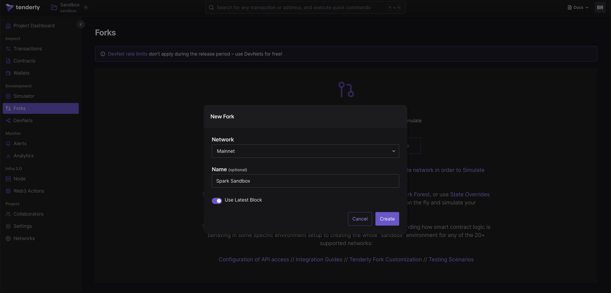

# Simple Tenderly Fork Setup Tutorial
#### 1. Create account on https://tenderly.co/
#### 2. Navigate to the <ins>Dashboard</ins>
#### 3. Select <ins>Forks</ins> on the left menu
#### 4. Click <ins>Fork a Network</ins>

#### 5. Pick a name for your fork and create your fork

#### 6. Click <ins>Fund Accounts</ins> to fund your account with ETH.
You fund any account on the fork with 10.000 ETH. You can send this ETH to your deployer account or to accounts that are going to be actors in your system.

#### 7. Connect your project to the fork
In order to do this copy the RPC URL of the fork and use it in your project. You can also add the forked network to your metamask, so you can easily interact with your app, from your browser, using your funded account

### <ins>Note:</ins> Addresses of all smart contract system in all protocols (and their state) are exactly the same as on the forked network (in this example - Ethereum Mainnet)
